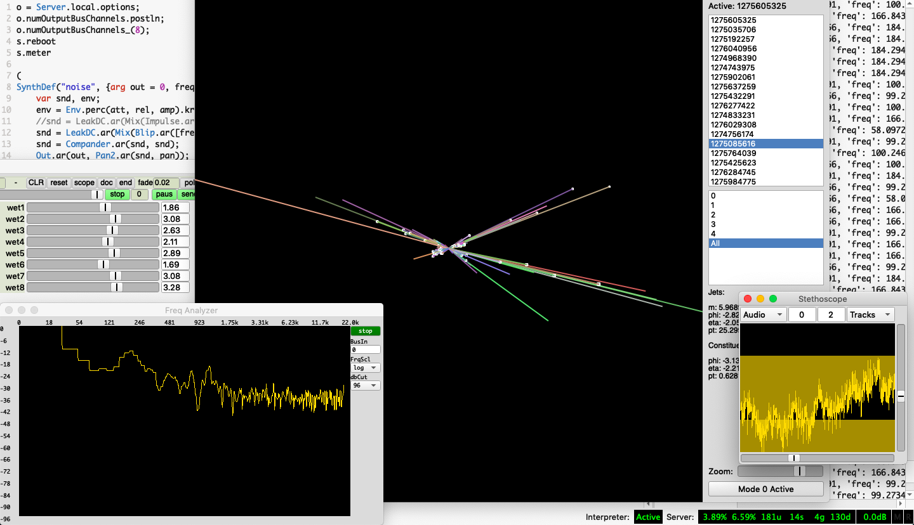

# Live Coding Boot Camp: make sound using data from CERN

## Description
This workshop will offer a hands on experience using SuperCollider for
real time sound synthesis and just in time improvisation, making it
ideal for sonic artists.

Programming sound applications with SuperCollider can be very rewarding
using its ready made sound generators to build novel instruments and
interactive media for laptop improvisation. However, once the software
is finished one can only interact with it on a higher level. On the
other hand, live coding as a performance strategy, allows to improvise
the structure of the instruments and alter their source code on the fly
enabling a wider range of interaction affordances. The workshop will
elaborate on the live coding project entitled Dark Matter involving
sonification of data from the Large Hadron Collider, at CERN, in
Switzerland.

## Requirements
For the workshop we will use the SuperCollider (open source) programming
language, a sound synthesis environment that is used for the development
of music software and interactive applications. It provides a state of
the art sound synthesis server and an Integrated Development Environment
(IDE) making it a powerful tool for real time audio applications used by
musical performers, researchers, and sound artists.

Requirements
+ No previous experience in programming but some familiarity with signal
processing will be helpful.
+ A computer with SuperCollider
installed(found at this link: http://supercollider.github.io/

+ A web browser (Safari, Chrome, Firefox).

## Encore
The workshop will culminate in a performance by the participants
involving live coding material developed during the workshop.
